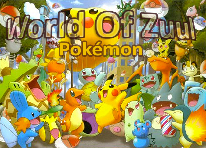

# World of Zuul

This was a project I had to do for school, together with a classmate Jeffrey.

The game looks similar to Pokemon.

### SWT jar download

Search for eclipse downloads and navigate down to the SWT library, download and extract the swt.jar
https://download.eclipse.org/eclipse/downloads/drops4/R-4.16-202006040540/

I am using `swt-4.16-gtk-linux-x86_64.zip` see the [lib](/lib) directory
